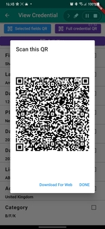

## Digital Credential Application

This project was developed using flutter to make it easier to automate the claims verifications process using cryptographic concepts.

### Directories Explained
---
- Example folder
  - contains example of JSON digital credential file created, QR codes, APK file if you want to run the app on your android device
- IssuerWebApplication
  - contains Issuer's web application implemented using codeIgnitor. Acts like issuer's software used for creating digital credentials
- libs
  - Contains code written to make the application using flutter. main.dart is the starting point of the application.

### Some of the features of mobile application 
---
>- Requesting Credential Document.
>- Presenting Credential using QR.
>- Downloading credential as JSON for web purpose.
>- Verification of credential.
>- Disclose only the fields required.
>- Stats on presented credential

### Some of the features of issuer's application
---
>- Enable API requests to send credentials requests 
>- Show credential requests 
>- Generate digital credentials for users

### Some Screenshots of the application

For help getting started with Flutter, Official Documentation is here [online documentation](https://flutter.dev/docs).
To start the issuer's web application, Official Documentation is here [online documentation](https://codeigniter.com/user_guide/index.html).